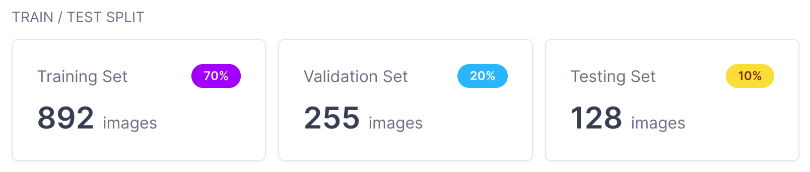
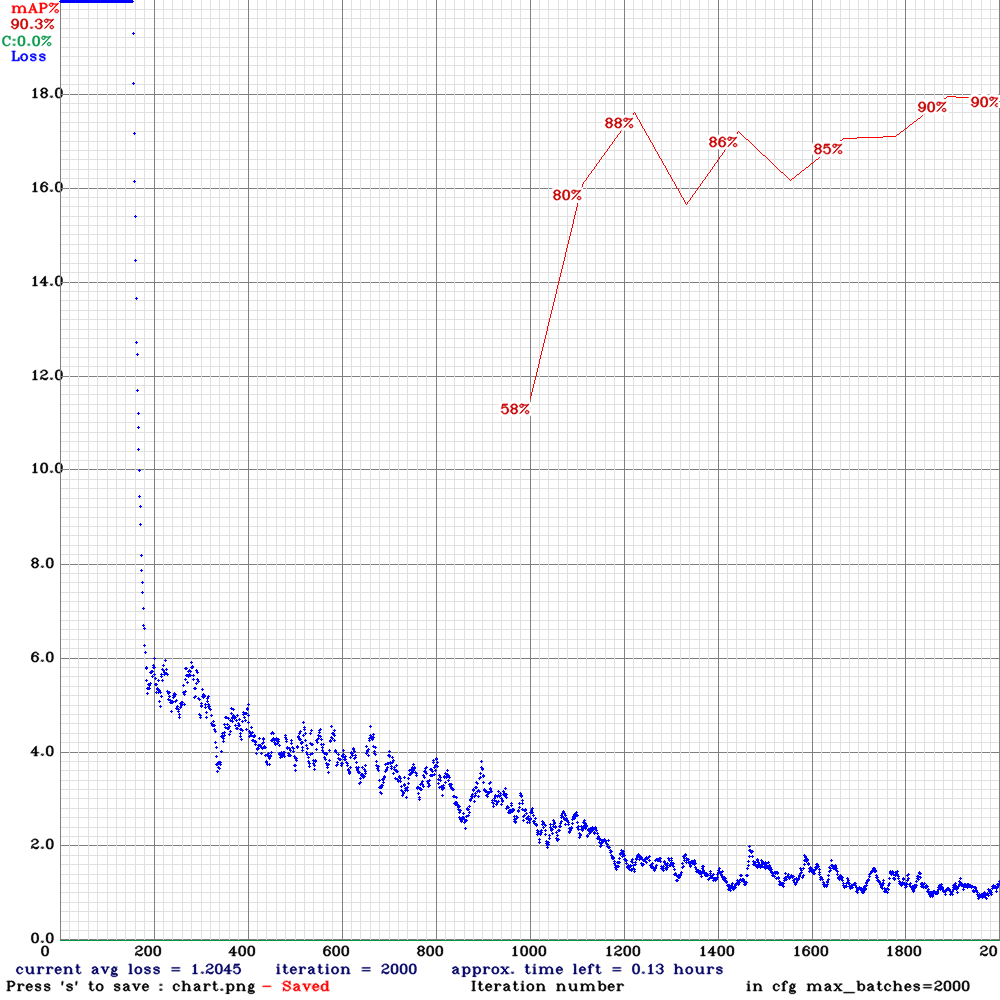

# Detect Disease On Coffee Leaves Using YOLOv4
---

## Download data from roboflow as YOLO darknet format
<pre>
!pip install roboflow

from roboflow import Roboflow
rf = Roboflow(api_key="mUdJjmR80LZIZmA8wAfq")
project = rf.workspace("nguyen-phu-vinh").project("coffee-leaves-hzi6b")
dataset = project.version(1).download("darknet")
</pre>

## Data

### Class 0:

### Class 1:

### Class 2:

### Class 3:

## Result

